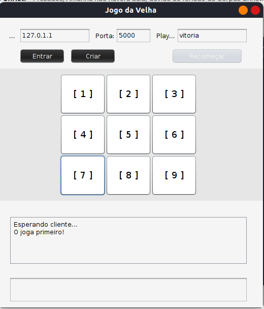

# Tic_Tac_Toe

Projeto desenvolvido para a disciplina de redes 2. O Jogo precisa ter dois usuários, em redes diferentes ou pelo menos, em máquinas virtuais diferentes. Dessa forma é possivel jogar o clássico jogo da velha no modelo pvp.

## Especificações

Projeto utiliza Java e Socket TCP/UDP para realizar a conexão

